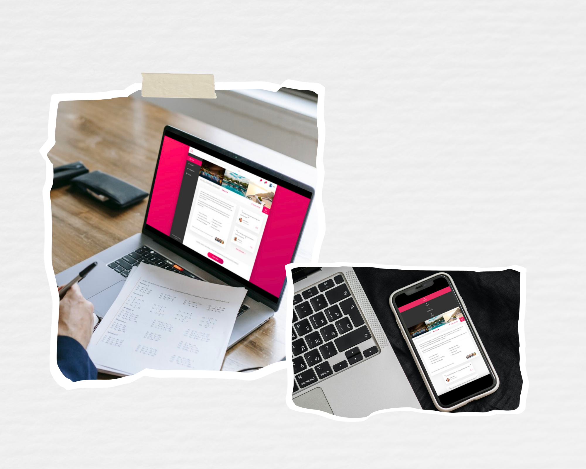

<p align="center">
  <a href="" rel="noopener">
 </a>
</p>

<h1 align="center">Trillo Project</h1>

<div align="center">

[]()
[](/LICENSE)

</div>
  
---

<p align="center"> An introduction to FlexBox

      
#### [Click here for live site](https://wills-trillo-project.netlify.app/)

</p>




## 📝 Table of Contents

- [About](#about)
- [Usage](#usage)
- [Requirements](#Requirements)
- [Installation](#Installation)
- [Built Using](#built_using)
- [Authors](#authors)

### About <a name = "about"></a>

The objective of this project was to build a responsive booking site to practice using Flexbox in CSS. This project helped me understand best practices of positioning, spacing, and alignment.

SVG (vectors) icons were also used throughout, as well as the BEM methodology, CSS variables, miscellaneous animations and a responsive design ensuring the site is accessible on all devices.

### Requirements

You will need to install [Node.js](https://nodejs.org/en/) to run this project.

Check the documentation to install it on your system.

### Installation

Once Node.js is installed, you will need to install several extensions to run the project.

Open the terminial/command line in your code editor, then install the following:

```
npm install node-sass ---save-dev
```

```
npm install postcss --save-dev
```

```
npm install npm-run-all --save-dev
```

```
npm install live-server --save-dev -w
```

```
npm run build:css
```

```
npm run start
```


Once the above are installed run the following commands:

```
npm run build:css
```

```
npm run start
```

```
npm watch:sass
```

```

"scripts": {
    "watch:sass": "node-sass sass/main.scss css/style.css -w",
    "devserver": "live-server",
    "start": "npm-run-all --parallel devserver watch:sass",
    "compile:sass": "node-sass sass/main.scss css/style.comp.css",
    "concat:css": "concat -o css/style.concat.css css/icon-font.css css/style.comp.css",
    "prefix:css": "postcss --use autoprefixer -b 'last 10 versions' css/style.concat.css -o css/style.prefix.css",
    "compress:css": "node-sass css/style.prefix.css css/style.css --output-style compressed",
    "build:css": "npm-run-all compile:sass concat:css prefix:css compress:css"
  },

package.json

```

### Usage <a name="usage"></a>

Changes can be made in the components SASS folder.
Run **npm watch:sass** to see in the browser all changes made in real time. 

### Built Using <a name = "built_using"></a>

- HTML - Markup Language
- CSS - Stylesheets
- [SASS](https://sass-lang.com/) - CSS Preprocessor
- [Node.js](https://sass-lang.com/) - CSS Preprocessor
- Flexbox - CSS web layout model
- SVGs - vector images

### Authors <a name = "authors"></a>

- [@willh89](https://github.com/willh89) - Built by
- [@jonasschmedtmann](https://github.com/jonasschmedtmann) - Idea & Initial Work
